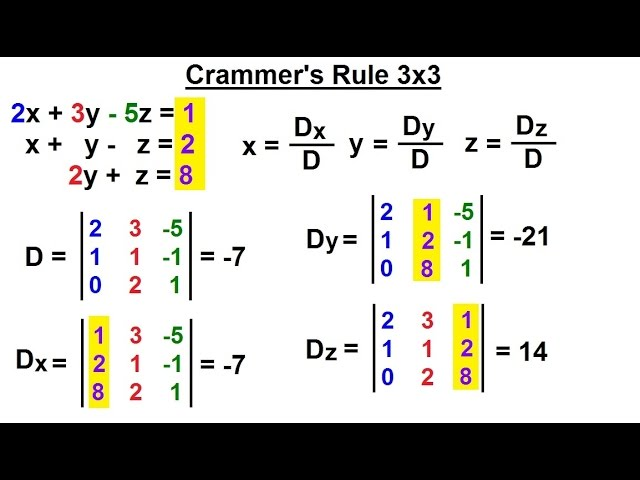

# Cramer
### A library designed to solve systems of linear equations using the cramer solution method. 
In order to function correctly, it is necessary to have a system with the same number of unknowns as equations.



## Functions:

### matr: 
>generates an n-dimensional matrix with the matrices from which the different coefficients will be extracted. The first matrix inside the array corresponds to the "original" delta

### delta:
>receives a matrix as input and returns a coefficient, calculated by subtracting the products obtained by the cross multiplication.

## Example Code:

```

#import numpy, cramer and creates a matrix with the factors to which each unknown number is multiplied and at the end of each row it adds the result of the linear equation

import numpy as np
from cramer import cramer

b = [[2 , 4 , 9 , 2],
     [4 , 7 , 2 , 3],
     [9 , 5 , 3 , 1]]

b = np.asarray(b)

# create an instance of the cramer class
cr = cramer(b)

#gets an array with the matrices corresponding to each coefficient
mds = cr.matr()

# generate a list with the coefficients obtained in each matrix after using the matr() method
deltas = []
for i in mds:
    deltas.append(cr.delta(i))

# to obtain the values ​​of each unknown, divide the different coefficients obtained by the first one, corresponding to that of the matrix of unknowns

for i in range(1 , len(deltas)):
    print("Variable" , i , ":")
    print(deltas[i] / deltas[0])
```